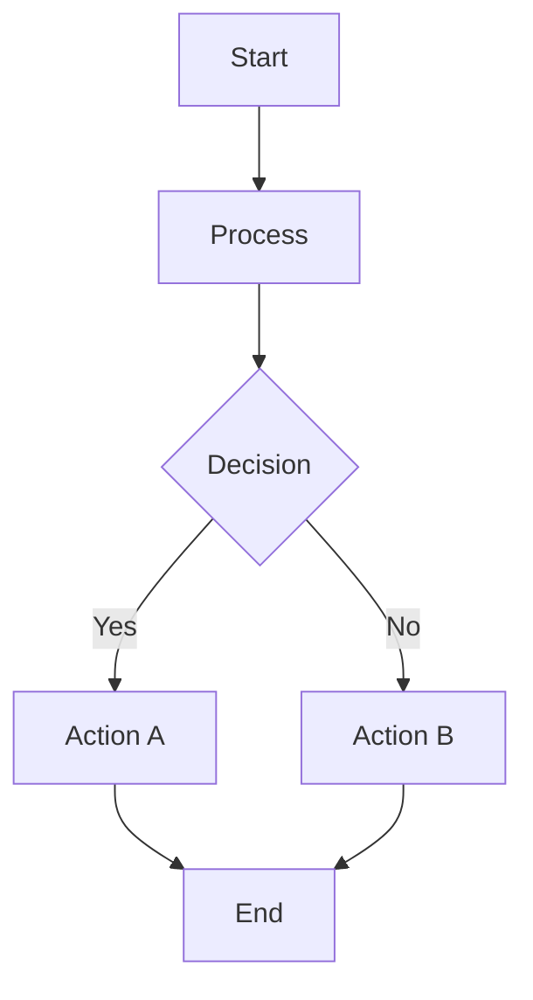

# Mermaid Editor 🌊 | Mermaid 编辑器

A modern, intuitive web-based Mermaid diagram editor with live preview and multiple export options.

一个现代化、直观的基于Web的Mermaid图表编辑器，支持实时预览和多种导出选项。

🌐 **[在线使用 | Try Online](https://mermaid.stevenchen.site/)**

## Features | 功能特点

- 🔄 Live Preview | 实时预览
- 🎨 Dark/Light Theme | 深色/浅色主题
- 🌍 Multi-language Support | 多语言支持
- 📤 Multiple Export Formats (SVG/PNG/PDF) | 多种导出格式（SVG/PNG/PDF）
- 📁 File Import/Export | 文件导入/导出
- 📱 Responsive Design | 响应式设计
- 🎯 Example Templates | 示例模板

## Supported Languages | 支持的语言

- 🇨🇳 Chinese (简体中文)
- 🇺🇸 English
- 🇫🇷 French (Français)
- 🇪🇸 Spanish (Español)
- 🇯🇵 Japanese (日本語)
- 🇩🇪 German (Deutsch)
- 🇷🇺 Russian (Русский)

## Getting Started | 开始使用

1. Open the editor in your browser | 在浏览器中打开编辑器
2. Write your Mermaid code in the editor | 在编辑器中编写Mermaid代码
3. See live preview on the right | 在右侧查看实时预览
4. Export your diagram in desired format | 以所需格式导出图表

## Example | 示例

## Supported Diagram Types | 支持的图表类型

- 🔄 Flowcharts | 流程图
- ⏱️ Sequence Diagrams | 时序图
- 📅 Gantt Charts | 甘特图
- 🏗️ Class Diagrams | 类图
- 🔄 State Diagrams | 状态图
- 🥧 Pie Charts | 饼图

## Development | 开发

This project uses:
本项目使用：

- HTML5
- CSS3
- JavaScript
- Mermaid.js
- jsPDF

## Author | 作者

Made with ❤️ by **Steven Chen**

由 **Steven Chen** 用 ❤️ 制作

## License | 许可证

MIT License

MIT 开源许可证